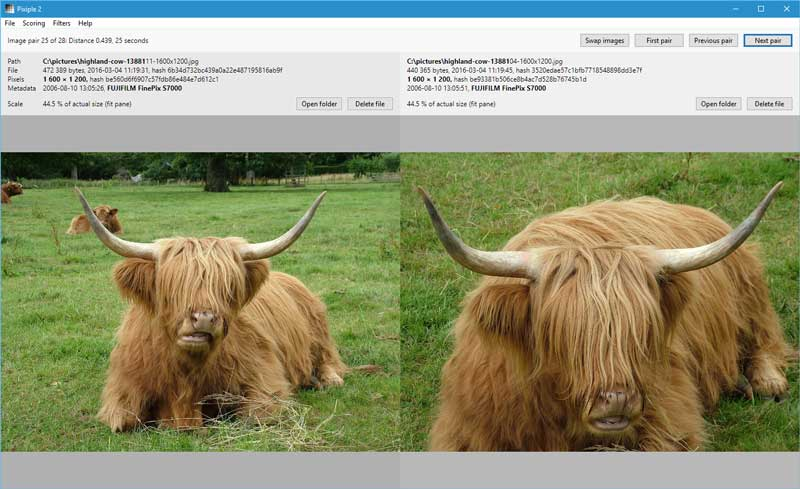

# Pixiple

## What's Pixiple?

Pixiple is a Windows application that searches your files for images that are similar in pixel and metadata content and presents you with a sorted list of similar image pairs to compare.

Unlike similar programs, Pixiple will attempt to find not only duplicate images but images that have something in common, either in their general appearance or their metadata, and may belong together. Pixiple also lets you compare two images (with synchronized zooming and panning) and check for minute quality differences (with the "swap images" button).

## Screenshot

## Features

- Uses both pixel and metadata content (dates, location, camera) to find related images.
- Fast, multi-threaded processing.
- Minimalist, resizable, localized, DPI-aware UI.
- Portable: single file, no settings saved, no installation required.
- Free, open source, no restrictions, no nonsense.
- Optimized for cows.

## Misfeatures

- Support for image file formats supported by Windows Imaging Component only (PNG, JPEG, GIF, TIFF, BMP).
- No caching of previous results, so all images must be processed every new scan.
- No installer.
- Cows not included.

## Requirements

Windows 7 or later.

For other versions of Windows, Pixiple requires access to Direct2D and Windows Imaging Component which may be available as updates for download from Microsoft. Pixiple will not work on Windows XP, however.

## Download

Download the executable from [Releases](https://github.com/olaolsso/pixiple/releases).

## What's similar?

Pixiple will easily detect images that are identical, have identical pixel content, are uniformly resized, flipped, rotated (90, 180, 270 degrees), are cropped along a single edge, or have minor differences in pixel content.

Pixiple is less well able to detect similar images with significant changes to pixel content (cropping or change of brightness, contrast, saturation, etc).

File metadata (name, size, date, format) is ignored when detecting similarity. By default, image paths are also ignored.
